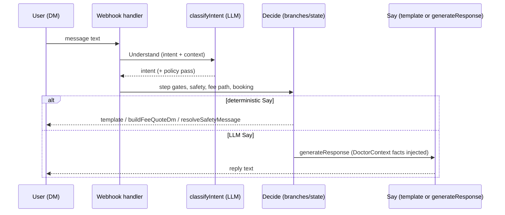

# Receptionist Bot — Conversation Rules & Intent Map

**Purpose:** Reference for how the receptionist bot should handle real-world user messages. Used by ai-service, webhook-worker, and related code.

**Related:**
- [AI_BOT_BUILDING_PHILOSOPHY.md](./AI_BOT_BUILDING_PHILOSOPHY.md) — stable strategy reference (LLM-first, broken patterns to avoid)
- [e-task-1: Receptionist bot conversation rules](../../Development/Daily-plans/March%202026/2026-03-10/e-task-1-receptionist-bot-conversation-rules-and-real-world-handling.md) — completed
- [e-task-2: Appointment booking flow refinements](../../Development/Daily-plans/March%202026/2026-03-10/e-task-2-appointment-booking-flow-refinements.md)
- [APPOINTMENT_BOOKING_FLOW.md](./APPOINTMENT_BOOKING_FLOW.md) — booking flow design

---

## Design Principles

1. **Receptionist-first:** Greet, offer help, then collect info. Never jump straight to "tell me your name" on "hello".
2. **AI for language, system for facts:** The **model** handles open-ended conversation and essentially any human language (no need to code every phrase). **Practice facts** (fees, hours, address, `consultation_types`, cancellation policy) come from **`doctor_settings`** and are injected into the system prompt (`DoctorContext` → `buildResponseSystemPrompt`). The model is instructed to treat those blocks as the **only** source of truth for pricing and to **never** claim fees are "not in the system" when the block lists them. A small set of **deterministic** paths remains for compliance (e.g. `medical_query` / `emergency` fixed copy, simple regex intents where useful).

### Three-layer pattern (industry-style AI receptionist)

| Layer | Role | Typical implementation here |
|-------|------|-----------------------------|
| **Understand** | Interpret user message (any language): intent + topics | `classifyIntent` (LLM); regex only for cheap wins (greeting, emergency speed) |
| **Decide** | Which flows/actions: fee block, booking step, safety, link | `instagram-dm-webhook-handler` branches + `ConversationState`; RBH-14 post-policies |
| **Say** | Wording, tone, empathy | `generateResponse` (LLM) and/or **server-composed** markdown (fee quote, links) — **₹ amounts and URLs must originate from code/DB**, not invented by the model |

**Guiding line:** *The model interprets; the platform executes; facts come from the database.*

**Roadmap:** See **RBH-17**–**RBH-20** (Tasks) — classifier `topics` / `is_fee_question`, hybrid reply composer, branch observability.

**Branch inventory:** [RECEPTIONIST_BOT_DM_BRANCH_INVENTORY.md](./RECEPTIONIST_BOT_DM_BRANCH_INVENTORY.md) — DM handler order, layers per branch, canonical fact paths.

#### Anti-patterns (avoid)

- ❌ Trying to encode **every** Hinglish or transliterated phrase as regex — unbounded; prefer LLM **Understand** + structured topics (RBH-18).
- ❌ Letting the model be the **only** source of **₹ amounts** or **URLs** — always inject server-rendered blocks or `AUTHORITATIVE FEES` from DB.
- ✅ Classifier returns **intent**; optional **topics** from JSON (`pricing`, …) in a future schema (RBH-18).

#### When regex / keywords are still OK

- **Emergency** signals — latency and safety (`isEmergencyUserMessage` before generic medical deflection).
- **Trivial greeting** — cost/latency (`SIMPLE_GREETING_REGEX` in `ai-service` when used).
- **Fixed compliance copy** — `medical_query` / `emergency` via `resolveSafetyMessage` (localized templates).
- **Narrow transactional parsers** — e.g. cancel “yes/no”, pick “1/2/3”, consent `parseConsentReply` — **not** open-ended language.

#### Request flow (sequence)

3. **RBH-16 (copy encoding):** Deterministic DM/booking strings prefer **ASCII `-` / ` - `** in templates so fixed copy does not show **mojibake** in Instagram or other clients.
4. **Medical boundary:** Never diagnose, prescribe, or give medical advice. Redirect medical/chief-complaint messages.
5. **Emergency handling:** Detect emergency language → redirect to emergency services immediately.
6. **Language matching:** Respond in the same language the user types in (English, Hinglish, Hindi written in English) — reinforced in the receptionist system prompt; optional locale helpers for **fixed** safety strings (RBH-15).
7. **Graceful degradation:** For unclear messages, stay polite and offer clear next steps.

**Product note:** We optimize for **correct clinic data** (fees, links, appointments), not for open-domain chat breadth — same posture as most AI receptionist products.

---

## Intent Map

| Intent | User Examples | Bot Action |
|--------|---------------|------------|
| `greeting` | Hi, Hello, Hey, Good morning, नमस्ते | Greet back, introduce practice, ask how to help |
| `book_appointment` | Book, schedule, I want an appointment | Start booking flow (name, phone, consent, slots) |
| `book_for_someone_else` | Book for my mother, schedule for my son, appointment for my wife | Collect other person's details, create patient, book under that person |
| `check_availability` | When free?, Available slots? | Show available slots |
| `ask_question` | Price?, Timings?, Location? | Answer from doctor settings |
| `medical_query` | I have fever, prescribe X, chief complaint | Redirect: "Speak with doctor during appointment or call clinic" |
| `emergency` | Chest pain, emergency, can't breathe | Redirect: "Call emergency services or go to nearest hospital" |
| `cancel_appointment` | Cancel, reschedule | Cancel/reschedule flow |
| `check_appointment_status` | Is it confirmed? When is my visit? | Look up and confirm (if implemented) |
| `revoke_consent` | Delete data, revoke consent | Revocation flow |
| `unknown` / `irrelevant` | Spam, vulgar, ???, nonsense | Polite deflection, offer options |

---

## Intent Priority

When multiple intents could apply: **emergency > medical_query > book_appointment > check_availability > ask_question > greeting > unknown**

---

## Conversation metadata (engine)

- **`state.step`:** Canonical flow position (`collecting_all`, `confirm_details`, `consent`, `awaiting_match_confirmation`, slot/cancel/reschedule branches, `responded`, …).
- **`state.lastPromptKind` (RBH-07 + RBH-13):** Machine-readable last gated prompt (`collect_details`, `confirm_details`, `consent`, `match_pick`, `cancel_confirm`, **`fee_quote`**). Usually refreshed from `step` (and **`state.activeFlow`** for fee quotes) when the DM handler persists state. Legacy rows may omit it; the worker still falls back to substring checks on the last system message where needed.
- **`state.activeFlow` (RBH-13):** Optional sub-flow. **`fee_quote`** = user is in a pricing thread; the bot must **not** start `collecting_all` on a misclassified `book_appointment` until they clearly ask to book (e.g. “book appointment”). Cleared when they enter real booking (slot link or intake).

## Fee & pricing (RBH-13)

- **Source of truth:** `doctor_settings.consultation_types` (plain text, max length enforced in API) **or** optional **compact JSON array** in the same field, e.g. `[{"l":"General (in-person)","r":500},{"l":"Video","r":400}]` (`l`/`label`, `r`/`fee_inr`/`amount`). The bot **never invents** rupee amounts; if empty, copy directs the user to the clinic / profile.
- **DM path (RBH-18):** `classifyIntent` returns `is_fee_question` / `topics` (`pricing`); `intentSignalsFeeOrPricing` ORs that with a **small** keyword fallback. Idle path → `buildFeeQuoteDm`; mid-intake → same fee block + continue footer without resetting `state.step`. Stays on `responded` + `activeFlow: 'fee_quote'` when idle.
- **Guardrails:** Meta strings (fee questions, “how do I book”) must not be stored as **`reason_for_visit`** during extraction (regex + collection validation + AI extraction prompt).

## Context-aware intent (RBH-14)

- **Problem:** Classifying **only** the latest user line mislabels e.g. “general consultation please” as **`book_appointment`** after a fee reply.
- **DM handler:** Loads **`state`** + **recent messages** (prior turns; current line not yet in DB) **before** `classifyIntent`.
- **`classifyIntent`:** Optional **`classifyContext`** — redacted **last N turns** + **`conversationGoal: fee_quote`** when `activeFlow` / `lastPromptKind` is fee quote. User prompt includes `Recent conversation` and `Current user message:`. **Intent cache is skipped** when context is present (same text can mean different intents in different threads).
- **`applyIntentPostClassificationPolicy`:** If the model still returns **`book_appointment`** in a **fee thread** and the message looks like **pricing / consultation-type follow-up** (not explicit book, not a long intake blob), downgrade to **`ask_question`**.

## Deterministic Rules (Before AI)

- **Simple greeting:** Regex match → `greeting` (skip AI)
- **Emergency keywords:** Match → `emergency` (skip AI)
- **Book for someone else:** Match "book for my X", "schedule for my X", etc. → `book_for_someone_else` (skip AI)
- **Mixed message:** e.g. "Hi I want to book" → let AI classify (don't match greeting regex)

---

## Language Matching

- Bot responds in the **same language** the user writes in.
- Supports: English, Hinglish, Hindi written in English (transliterated), Hindi (Devanagari).
- Instruction in AI prompt: "Respond in the SAME language the user writes in."

---

## Fixed Response Templates

| Intent | Template |
|--------|----------|
| `medical_query` | **RBH-15:** Localized via `resolveSafetyMessage('medical_query', userText)` — English, **Devanagari Hindi**, **Gurmukhi Punjabi**, or **Roman Hindi / Punjabi** from script + simple keyword cues. Same meaning: scheduling assistant only; see doctor / call clinic. |
| `emergency` | **RBH-15:** Localized emergency redirect + **India 112/108** in `resolveSafetyMessage('emergency', userText)`. **Pattern-based emergency** (`isEmergencyUserMessage`) runs **before** `medical_query` so Indic chest pain / breathless / poison phrases are not deflected as generic medical_query. Booking phrases `emergency appointment` / `urgent appointment` are excluded. |

---

**Last Updated:** 2026-03-28 (RBH-17: anti-patterns, keyword policy, mermaid, DM branch inventory link)
