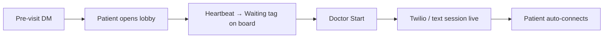

# Charter — Consult room check-in

> **Program:** [`README.md`](./README.md) · Prefix `crc`  
> **Locked:** 2026-08-12  
> **Scope of this doc:** product + architecture decisions only. Implementation lives in phase batch plans.

---

## Problem

Doctor should never wait for a patient to join a video/voice/text consult because we only sent the link when the doctor started. Applies to **slot mode** and **queue (token) mode**.

---

## Core idea (locked)

**Separate the lobby from the media room.**

- Lobby = free patient-facing holding page + presence heartbeat. No Twilio room.
- Media room = still created lazily on doctor **Start** (video/voice). Text may still use the existing pre-ping session row.
- When the doctor starts, a checked-in patient is **pulled into the room with zero taps** (page already open; sees `live` → auto-connects).

---

## Decision lock (program-wide)

| ID | Decision | Implication |
|----|----------|-------------|
| **CRC-D1** | **Lobby ≠ media room.** Never provision Twilio rooms for check-in. | Avoids orphan rooms / cost; keeps current lazy create for video/voice. |
| **CRC-D2** | Presence is a **tag**, not a lifecycle: `patient_waiting` · `patient_stepped_away`. | Fits OSM three-axis model; does not fight Incomplete / Overdue / Upcoming sections. |
| **CRC-D3** | Heartbeat columns live on **`appointments`**, not `consultation_sessions`. | Video/voice have no session row until Start; lobby must work before session create. |
| **CRC-D4** | **Slot mode** check-in DM at **T−30 min** (env-configurable; default 30). | Enough runway for device issues; not so early they wander off. |
| **CRC-D5** | **Queue mode** check-in DM when `aheadCount <= 3` (and not already checked in). | Position-anchored; reuses the existing `your_turn_soon` concept with an outbound channel. |
| **CRC-D6** | Check-in DM primary link = **modality lobby URL** (video `/consult/join?token=`, voice `/c/voice/…`, text `/c/text/…`). `/my-visit` remains the status hub; may deep-link from lobby. | One tap into the waiting room. |
| **CRC-D7** | Video early open **must not throw**. Return a `not_started` / holding state (match voice/text). | Unblocks lobby without creating a room. |
| **CRC-D8** | Fresh heartbeat threshold: **last_seen within 2 minutes** → `patient_waiting`; checked in but stale → `patient_stepped_away`; never checked in → no presence tag. | Mobile tabs background; avoid binary flicker. |
| **CRC-D9** | Doctor may **Start anytime** a patient is `patient_waiting` (including before slot start). No new “block early start” gate. Existing early-join offer stays for non-checked-in patients. | Checked-in = startable. |
| **CRC-D10** | **Phase 1 is poll-only** (patient lobby ~5s; doctor board stays 30s). Realtime is p2. | Ships value without first Realtime surface on OPD board. |
| **CRC-D11** | Consult-ready fan-out on Start **still runs** (resend / late openers). Check-in DM is additive, not a replacement. | Patients who ignore check-in still get a link. |
| **CRC-D12** | Check-in DM uses existing fan-out channels (SMS + email + Instagram DM). **Facebook Messenger consult fan-out gap is out of scope for p1** — document only. | Do not expand channel matrix in this program’s first phase. |
| **CRC-D13** | No PHI in logs. Heartbeat timestamps are operational, not clinical notes. Migration must not introduce RLS keyed on `auth.uid()` for patient lobby (patient auth stays HMAC). | Keeps Opus migration review narrow. |

---

## Non-goals (program)

- Device quality pre-check (p3).
- Supabase Realtime lobby (p2).
- Changing Twilio room naming / recording / consent flows.
- Replacing `sendConsultationReadyToPatient`.
- Fixing Facebook Messenger join fan-out (track separately).
- Auto-no-show driven solely by missing check-in (signal only; no status flip in p1).

---

## Success metric (product)

Doctor clicks Start → hears/sees patient within **~0–5 s** when the patient was already in lobby, instead of waiting on notification + app-switch latency.

---

**Created:** 2026-08-12.
