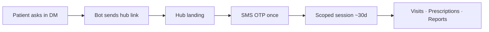

# Charter — Patient health hub

> **Program:** [`README.md`](./README.md) · Prefix `phh`
> **Locked:** 2026-08-13
> **Scope of this doc:** product + architecture decisions only. Implementation lives in phase batch plans.

---

## Problem

A patient who wants their own record has nowhere to go. Every patient-facing surface we have — twelve routes today — is scoped to **one appointment or one session** via a 24-hour HMAC token. There is no answer to "what did the doctor prescribe me in March?" except "search your DMs."

The failure mode is not that patients are demanding a portal. It is that they lost the message, so they ask the clinic, so a human re-sends a PDF that the system could have served.

---

## Core idea (locked)

**The DM is the login.**

The patient already authenticated by being the Instagram / WhatsApp / Facebook account we have been talking to. Reuse that instead of building an identity system on top of it.

- The bot dispenses a **patient-scoped** link on request.
- The link opens a hub scoped to **one doctor's** record of that patient.
- Anything clinical behind the link requires an **SMS OTP** once, then a ~30-day session.

---

## Why not patient accounts

Recorded so this is not re-litigated every quarter.

1. **It contradicts the wedge.** The product promise is that the patient installs nothing and signs up for nothing. A password is the highest-friction thing we could add to the funnel, in front of the cohort least likely to complete it.
2. **The schema has no concept of "a patient."** It has "a patient of a specific doctor." Migration 113 keyed identity on `(doctor_id, platform, platform_external_id)` and `perdoctor-identity-backfill.ts` actively splits one human into per-doctor rows with consent reset to pending on the clones. A login implies a global person — that is an identity-merge project, not a feature.
3. **There is no patient-read authorization anywhere.** Every clinical policy is `auth.uid() = doctor_id`, the backend runs on the service-role client, and the only patient-side policy in the schema is the `consult_role` claim branch on `consultation_messages` (migration 052). Patient-authenticated PHI reads are a new authorization layer regardless of whether accounts exist.
4. **No demand signal yet.** The intent classifier has twelve intents and none of them is "show my records." If patients were asking, it would have surfaced there first — which is exactly why p1 below is the intent work, not the hub.

---

## Decision lock (program-wide)

| ID | Decision | Implication |
|----|----------|-------------|
| **PHH-D1** | **No patient accounts.** No `auth.users` row, no password, no `patients.auth_user_id`. The DM channel is the identity proof. | Zero signup friction; no new identity domain. |
| **PHH-D2** | **Per-doctor scope.** The hub is "your visits with Dr. X", never "your health record". One human with two doctors gets two hubs. | Matches migration 113 exactly. Also the right privacy answer — Dr. A's hub must not reveal that the patient sees Dr. B. |
| **PHH-D3** | **Records tabs are OTP-gated.** Link → landing → SMS OTP → scoped session cookie (~30 days). Reuse `video-replay-otp-service.ts` verbatim: 6 digits, 5-min TTL, salted SHA-256 at rest, 3 sends/patient/hour, 5 wrong attempts. | Feels like a login to the patient and to a regulator, without an account existing. Check whether `video_otp_window` (migration 070) generalises before adding a second table. |
| **PHH-D4** | **New patient-scoped token**, separate secret and audience from `CONSULTATION_TOKEN_SECRET`, carrying `patient_id` + `doctor_id`, **server-side revocable**. | A 24h token exposing one join link is a small blast radius. A 30-day token exposing full history is not. Revocation is not optional. |
| **PHH-D5** | **Read-only in v1.** No patient-authored writes: no uploads, no messaging, no self-reschedule, no profile edits. | Every write is a new authz surface and a new abuse surface. Reads first. |
| **PHH-D6** | **Column allowlist, never exclude-list.** Patient-facing readers enumerate the fields they return. `prescriptions.assessment_note` and `assessment_acuity` are clinician-only and must never leave the server. | An exclude-list leaks the first time someone adds a column. |
| **PHH-D7** | **`/my-visit` becomes the hub's Now tab.** Links already sent in DMs keep working unchanged. | No breaking change to tokens already in the wild. |
| **PHH-D8** | **Deletion revokes hub access.** The account-deletion worker must invalidate hub tokens and sessions, mirroring the `signed_url_revocation` prefix pattern. | Otherwise deletion is incomplete and the DSAR story breaks. |
| **PHH-D9** | **Reuse existing artifacts.** Prescription PDFs, transcript PDFs, replay, `/r/[id]` share pages already exist. The hub links to them; it does not re-render them. | The hub is a directory over shipped surfaces, not a second rendering stack. |
| **PHH-D10** | **Audit every patient-authenticated PHI read** to `audit_logs`, PHI-free metadata only. | Patient-authenticated access to clinical data is a compliance event, not a page view. |
| **PHH-D11** | **Rate-limit every hub endpoint** using the existing `publicSessionLimiter` / `replayMintLimiter` patterns. | The hub is unauthenticated-by-design at the edge. |
| **PHH-D12** | **Delivery is channel-agnostic.** The bot dispenses the link over whatever channel the patient is on — Instagram, Facebook, WhatsApp, SMS, email. No channel-specific hub. | Depends on `crc` p4's Facebook fan-out; WhatsApp remains unwired and is a known gap. |
| **PHH-D13** | **Accounts get reconsidered only on an explicit trigger** (see below), with the demand documented. | Prevents "we should probably add login" drifting back in. |

### PHH-D13 trigger conditions

Revisit real accounts only when one of these is actually requested, not anticipated:

- Cross-clinic records in one place.
- Family / dependant management (one adult managing several patients).
- Patient-uploaded documents before a visit.
- Booking history spanning doctors.

---

## Non-goals (program)

- Patient accounts, passwords, or a global person identity (PHH-D1, PHH-D2).
- Cross-doctor record merging.
- Any patient write path in v1 (PHH-D5).
- A second PDF or document renderer (PHH-D9).
- Replacing `/r/[id]`, `/c/history`, `/c/replay` — the hub links to them.
- Wiring WhatsApp. Tracked separately; the scaffold at `backend/src/workers/channels/whatsapp/` is unwired.
- Anything that changes doctor-side surfaces.

---

## Success metric (product)

A patient can retrieve their most recent prescription **without asking the clinic and without creating an account**, in under a minute from asking in DM.

Counter-metric worth watching: inbound "can you resend my prescription / when is my appointment" messages should fall. If they do not, the hub is not the thing patients wanted and p3+ should be reconsidered rather than continued.

---

## Sequencing note

p1 is deliberately the **cheapest** phase, not the foundational one. The bot can already send prescriptions (`sendPrescriptionToPatient`) and the share page `/r/[id]?t=` already exists — so DM retrieval needs new intents and no new surface at all. Shipping it first produces the demand signal that tells us whether the hub in p2/p3 is worth its migration and its auth work.

If p1 ships and nobody uses it, that is a cheap and extremely valuable answer.

---

**Created:** 2026-08-13.
