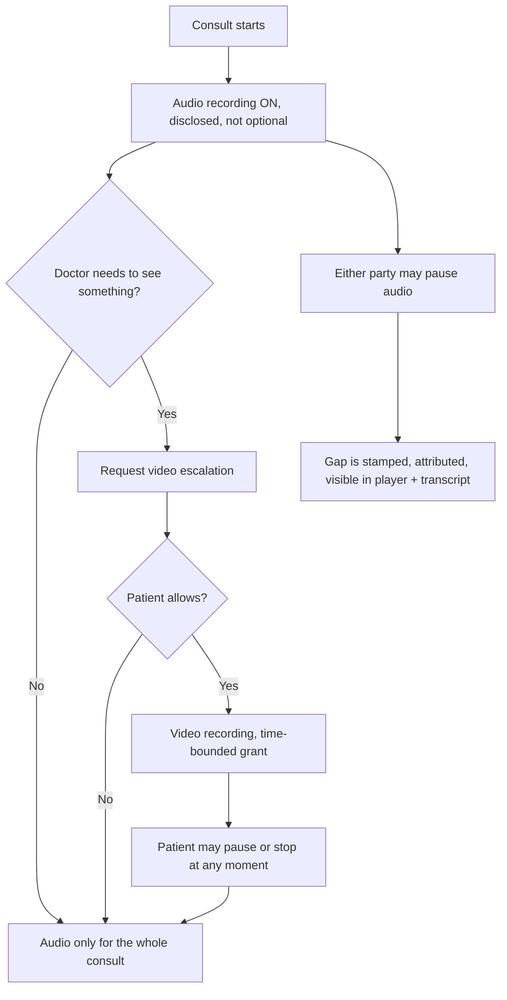

# Charter — Recording governance v2

> **Program:** [`README.md`](./README.md) · Prefix `rec`
> **Locked:** 2026-08-17
> **Supersedes (in part):** Plan 02 Decision 4, Plan 08 Decision 10 — see §Reversals.
> **Scope of this doc:** product + architecture decisions only. Implementation lives in phase batch plans.

---

## Problem

Three findings, in descending order of severity.

**1. The recording of a video consult cannot be found.** `resolveAudioArtifact` (`backend/src/services/recording-access-service.ts:264`) has two lookup paths: `recording_artifact_index`, and `consultation_transcripts.composition_sid` as fallback. Nothing in `backend/src/` ever inserts into `recording_artifact_index` — every reference is a read or an update. And only `voice-session-twilio.ts:192` enqueues transcription, so only voice consults ever get the fallback row. A video consult records audio to Twilio and then neither party can play it back. Voice replay works today by accident, riding on the transcription table.

Downstream, the same empty table means the nightly archival worker has zero candidates, so retention and deletion are no-ops regardless of the `ARCHIVAL_HARD_DELETE_ENABLED` flag.

**2. We promise a recording opt-out we do not honour.** The booking checkbox implies the patient can decline recording. Twilio recording rules are applied at room create (`consultation-session-service.ts:145`, `voice-session-twilio.ts:183`) without ever calling `getConsentForSession`. Declining only disables transcription and snapshots; the audio is captured either way. Under DPDP §6 that gap — telling the patient one thing and doing another — is a larger exposure than the retention gaps.

**3. Pause does not stop video.** `recording-pause-service.ts:100` hardcodes `DEFAULT_KIND = 'audio'`. When video is being recorded and the doctor pauses, audio stops and video keeps rolling — the inverse of what anyone pressing pause expects, in exactly the moments pause exists for.

---

## Core idea (locked)

**Audio is a disclosed mandate. Video is the patient's, at every moment. The record is honest about its own gaps.**

- Audio recording is part of the medical record. It is disclosed at booking, not consented to, and cannot be disabled by doctor or patient.
- Video recording is opt-in per instance, and the patient holds pause and stop permanently — not behind a menu, not requiring a request.
- Recording can be paused by either party at any time. Every pause is permanently attributed, timestamped, and rendered in both the player and the transcript. You cannot erase; you can only annotate.

---

## Reversals — what this charter overturns

| Prior decision | Where | Now | Why |
|---|---|---|---|
| Plan 02 **Decision 4** — "recording-on-by-default" with a patient consent checkbox and a re-pitch on decline | `RecordingConsentCheckbox.tsx`, `recording-consent-service.ts` | **REC-D1** — disclosure, no checkbox, no opt-out for audio | The opt-out was never honoured in code. Either honour it or stop offering it; offering it falsely is the worst of the three options. |
| Proposal to gate the video-escalation button by specialty | Discussed 2026-08-17, **not built** | **REC-D6** — no specialty gate | Specialty is a poor proxy for clinical need (GPs see rashes, wounds, jaundice constantly), `doctor_settings.specialty` is self-declared, and the real control belongs to the patient, not the platform. |
| Plan 08 Task 42 — "revoke shares the cooldown/idle arithmetic with decline/timeout" | `recording-escalation-service.ts:793-822` | **REC-D9** — consensual stop costs nothing | Written when revoke signalled discomfort. Under REC-D7 stopping is a normal, expected control; penalising the doctor for it breaks the clinical workflow. |

Plan 08 Decision 10 (audio-only baseline, video by escalation only) is **kept and reinforced**, not reversed.

---

## Decision lock (program-wide)

### Audio — the mandate

| ID | Decision | Implication |
|----|----------|-------------|
| **REC-D1** | **Audio recording is mandatory and disclosed, not consented.** The booking checkbox and its re-pitch modal are removed and replaced with a clear disclosure. Recording is framed as part of the medical record. | Removes the false promise. Simplifies the always-on path — no consent branch. |
| **REC-D2** | **Legal gate.** REC-D1's DPDP basis (necessity for the stated purpose of medical record-keeping under the Telemedicine Practice Guidelines 2020) must be signed off by counsel before the disclosure copy ships to production. Code may land behind the copy; the policy version string is owner-approved, not agent-authored. | This is the one decision in the charter an agent must not resolve on its own. |
| **REC-D3** | Existing `appointments.recording_consent_decision` / `_at` / `_version` columns are **retained read-only** for historical record. No new writes after p2. No migration drops them. | Consultations booked under the old regime keep their true consent state. |
| **REC-D4** | Doctors accept a **versioned recording attestation** before their first consult. Six clauses (see §Attestation). Not configurable, not skippable. | Makes the mandate a two-sided commitment rather than a platform imposition. |
| **REC-D5** | **A doctor can never delete a recording.** Deletion is policy-driven and automatic, or patient-initiated erasure. No doctor-facing delete affordance, ever. | Clause 2 of the attestation. Protects the patient and the doctor. |

### Video — the patient's choice

| ID | Decision | Implication |
|----|----------|-------------|
| **REC-D6** | **No specialty gate on video escalation.** Every doctor gets the button. Escalation rate per doctor is a review signal, not a block. | Reverses the 2026-08-17 proposal. The patient-side control is the real gate. |
| **REC-D7** | The patient holds **pause and stop for video at all times**, persistently visible, never behind a menu or a request-and-approve handshake. | Pause is resumable without re-consent; stop ends the grant and a restart needs a fresh request. |
| **REC-D8** | **Video grants are time-bounded.** Default 2 minutes, visible countdown to both parties, auto-reverts to audio-only on expiry, doctor may extend once. | The clinical need is "look at this now," not "watch me for the rest of the call." |
| **REC-D9** | **A consensual stop costs the doctor nothing.** Allow-then-stop does not consume an escalation attempt and does not trigger the 5-minute cooldown; a 30-second debounce replaces it. Decline and timeout keep the existing attempt-count and cooldown. | Splits the counters in `deriveState`. Without this, one stop can lock a consult out of video entirely. |
| **REC-D10** | **Stop halts future capture; it is not deletion.** Copy must never imply otherwise. Withdrawal of consent is served by a separate erasure path (REC-D19). | The doctor may already have formed a clinical judgement on what they saw; destroying it mid-consult is its own liability. |
| **REC-D11** | On stop, the client **kills the local video track immediately**, then calls the server. The server rule-flip remains the ledger's source of truth. | A control framed as "yours at any moment" cannot have a 1–3 s server round-trip in it. |
| **REC-D12** | The patient may **offer** video without being asked. An offer is self-consenting — no modal — and does not consume a doctor attempt. | `patient_request` already exists as a preset reason; today it still costs an attempt and a modal. |

### Pause — honest gaps

| ID | Decision | Implication |
|----|----------|-------------|
| **REC-D13** | **Pause applies to every active recording kind.** Never audio-only while video is live. | Fixes `DEFAULT_KIND = 'audio'`. Treated as a defect, not an enhancement. |
| **REC-D14** | **Pause reasons are preset codes. No free text in governance tables.** Codes: `patient_request`, `sensitive_disclosure`, `third_party_present`, `administrative`, `technical`. | A doctor pausing for a sensitive disclosure will otherwise type what it was, writing the protected content into `consultation_recording_audit.reason` and onward into `archival_history`. |
| **REC-D15** | **Both parties can pause audio directly**, with the actor permanently attributed. No approval handshake. | Under-disclosure is a worse clinical outcome than a gap. A patient-initiated gap is evidence that protects the doctor, not a hole. |
| **REC-D16** | Pause **auto-resumes after 5 minutes**, with a visible countdown and one extension. A consult that ends while paused stamps the dangling row. | The failure mode is forgetting, not abuse. A consult that is mostly unrecorded but looks complete is the worst artifact we can produce. |
| **REC-D17** | **Every gap is rendered in both the replay player and the transcript**, sourced from the audit ledger. | The composition simply omits the window, so an un-annotated transcript reads as an unbroken conversation. In a clinical record that is actively misleading. |
| **REC-D18** | No hard cap on cumulative pause time in v1. Past a threshold, nudge and flag the session. | A ceiling hit mid-consult leaves no good behaviour available. Let the data drive enforcement later. |

### Artifacts, access, retention

| ID | Decision | Implication |
|----|----------|-------------|
| **REC-D19** | **`recording_artifact_index` is the canonical registry**, written when a composition finalises. The `consultation_transcripts` fallback is retired once the index is populated and backfilled. | Unblocks replay, retention, deletion, and the doctor timeline. Everything else in this program depends on it. |
| **REC-D20** | Video consults produce artifact rows for their **audio** composition, at parity with voice. | Today they produce none, which is finding #1. |
| **REC-D21** | Composition-finalised is delivered by **Twilio webhook**, with the existing poll retained as fallback. | `voice-transcription-worker.ts:133-135` has carried this TODO since April. |
| **REC-D22** | **Hard delete must reach Twilio.** The archival worker deletes Supabase objects today; the primary media is Twilio-hosted. DPDP erasure is not satisfied by the `signed_url_revocation` blocklist alone. | REC-D10 is only honest if withdrawal can actually remove the file. |
| **REC-D23** | The doctor's durable home for recordings is a **consult timeline on the patient profile** — not a standalone "Recordings" tab. | The clinical mental model is *this patient*, not *this recording*. A surveillance-shaped surface will not get used. |
| **REC-D24** | **Replay notification is symmetric and non-suppressible.** Both parties are told when the other replays. | **Corrected 2026-08-17 during p5 planning; completed 2026-08-20 in rec-30.** Both directions already existed (`notifyPatientOfDoctorReplay` and `notifyDoctorOfPatientReplay`). rec-30 closed the remaining gaps: (a) support-staff replays now notify the patient (copy names a support agent, not "your doctor") as well as the doctor; (b) dashboard-only doctor channel **upheld** — symmetric means coverage, not identical channels; (c) silent skips write `audit_logs` (`patient_recording_replay_notification` / `doctor_recording_replay_notification`, `status: failure`, `obligation: unfulfilled`). No replay-notification opt-out exists. |
| **REC-D25** | Patient self-serve window stays **90 days**; doctor access runs the full retention period. Video replay keeps its OTP gate. | Unchanged from Plan 02 Decision 4. Not re-litigated. |

---

## Attestation (REC-D4) — the six clauses

Doctors accept these, versioned, before their first consult. None are configurable.

1. Every voice and video consult is audio-recorded. You cannot disable this.
2. You cannot delete a recording. Deletion is policy-driven and automatic.
3. The patient has the same access you do, self-serve for 90 days.
4. Your replays are logged and the patient is notified.
5. Streaming only. No download, no re-recording, no sharing outside the platform.
6. Video capture requires explicit patient consent, every single time.

Clause 4 does the heavy lifting for patient trust and is already half-built. Lead with it in patient-facing copy too.

---

## Non-goals (program)

- Changing the 90-day patient self-serve window or the video replay OTP gate (REC-D25).
- Transcribing video tracks. Audio remains the only transcription input.
- Watermarking beyond the existing client-side overlay. Stream-only + audit rows remain the defence.
- Building the patient health hub — [`phh`](../../13-08-2026/patient-health-hub/README.md) owns the patient's durable home; this program only guarantees the artifact it will link to.
- Encrypted compositions (Twilio public-key encryption). Track separately.
- Any change to Twilio room naming, lazy room creation, or the check-in lobby (`crc` program).
- Re-litigating Plan 08 Decision 10's audio-only baseline.

---

## Success metrics

1. **Reachability:** 100% of ended voice and video consults have a playable artifact resolvable from `recording_artifact_index` within 5 minutes of the call ending. Today video consults are at 0%.
2. **Honesty:** zero consults where the recording state shown to the patient differs from what is actually captured.
3. **Patient control latency:** video capture stops within 250 ms of the patient confirming stop (client-side track kill), independent of server round-trip.
4. **Gap visibility:** every paused window appears in both the player timeline and the transcript, with actor and reason code.

---

## Migration budget

Next free number at time of writing is **196** (`195_appointment_start_notify_stamp.sql` is the head). Three migrations are anticipated:

| Number | Phase | Content |
|---|---|---|
| 196 | p2 | Doctor recording attestation (versioned acceptance) |
| 197 | p3 | Pause reason preset codes + auto-resume stamps |
| 198 | p4 | Video escalation grant bounds + patient pause state |

**Every migration task must re-derive its own number** from the live `backend/migrations/` head before writing the file — phases may execute out of order or other programs may land first. The numbers above are budget, not reservation.

Per [`00-agent-contract.mdc`](../../../../../.cursor/rules/00-agent-contract.mdc), all three are **Opus-only** and must not be written by Auto. Any task that discovers it needs a fourth migration, or any RLS change, **stops and surfaces it**.

---

## Related code (anchors)

| Concern | Path |
|---------|------|
| Audio-only baseline at room create | `backend/src/services/consultation-session-service.ts:145` |
| Voice adapter recording rules + transcription enqueue | `backend/src/services/voice-session-twilio.ts:183,192` |
| Twilio rule wrapper (merge-aware) | `backend/src/services/twilio-recording-rules.ts` |
| Rule flips + artifact listing | `backend/src/services/recording-track-service.ts` |
| Pause / resume ledger | `backend/src/services/recording-pause-service.ts` |
| Escalation state machine | `backend/src/services/recording-escalation-service.ts` |
| Replay authZ + URL mint | `backend/src/services/recording-access-service.ts` |
| Composition metadata + signed URL | `backend/src/services/twilio-compositions.ts` |
| Archival hide / hard-delete | `backend/src/workers/recording-archival-worker.ts` |
| Consent capture (being retired) | `backend/src/services/recording-consent-service.ts` |
| Artifact registry schema | `backend/migrations/056_recording_artifact_index.sql` |
| Retention policy + seed | `backend/migrations/055_…`, `058_…` |
| Patient replay route | `frontend/app/c/replay/[sessionId]/page.tsx` |
| Replay player | `frontend/components/consultation/RecordingReplayPlayer.tsx` |
| Doctor post-consult surface | `frontend/components/consultation/cockpit/EndedCard.tsx` |
| Patient video stop | `frontend/components/consultation/VideoRecordingIndicator.tsx` |
| Patient consent modal | `frontend/components/consultation/VideoConsentModal.tsx` |

---

**Created:** 2026-08-17.
