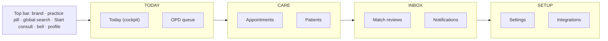
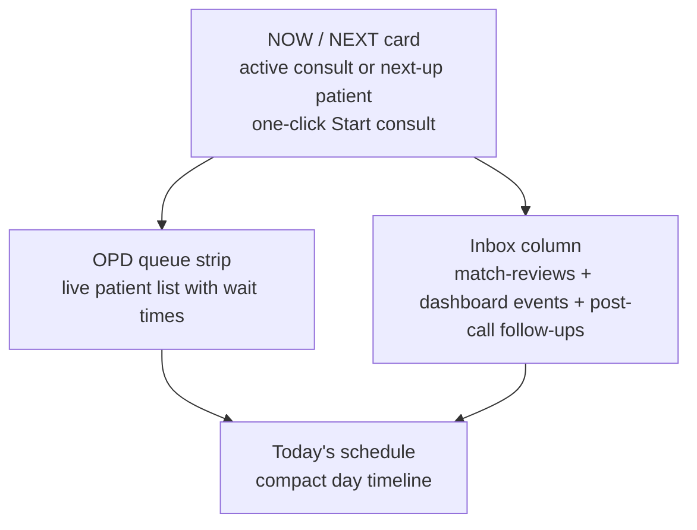

# Plan — UI system redesign (Shipped)

## Turn the doctor dashboard from a generic V0 shell into Clariva's actual product surface

> **Status: Shipped** (per `ehr/` legend: `Drafted` → `Selected` → `Committed` → `Shipped`). Work was executed via dated batches under `Daily-plans/` — see [plan-ui-system-redesign-batch.md](../Daily-plans/May%202026/06-05-2026/plan-ui-system-redesign-batch.md) (May 2026).
>
> **Reference.** The decision matrix and `Decision:` notes below stay for audit and product history. Each item originally had `Yes` / `No` / `Modify`; future UI work should use new or appended plans rather than treating this file as an active gate.
>
> **Companion file (legacy):** `c:\Users\abhisheksahil\.cursor\plans\clariva-ui-system-redesign_9a557ed2.plan.md` was the agent-facing draft; it may be stale relative to shipped code and this document.

---

## Why this plan exists now

**Historical context (pre–UI redesign).** The product had already shipped deep functional surface (EHR T1–T5, full consult FSM across text/voice/video, OPD queue, IG-DM funnel, settings tree, branded PDF Rx, public `/r/[id]` patient view, recording/replay, modality upgrade FSM, dashboard events). The shell exposing all of that was still a generic V0 admin:

- [`frontend/app/globals.css`](../../../frontend/app/globals.css) is the bare three `@tailwind` lines — zero design tokens.
- [`frontend/tailwind.config.ts`](../../../frontend/tailwind.config.ts) has `extend: {}` — no theme.
- [`frontend/components/ui/`](../../../frontend/components/ui/) holds 3 utility files — no Card, Button, Badge, Input, Tabs, Dialog primitives.
- [`frontend/public/`](../../../frontend/public/) has no brand assets (no logo, no favicon, no OG image).
- [`frontend/components/layout/Sidebar.tsx`](../../../frontend/components/layout/Sidebar.tsx) is six flat links with mixed casing and no icons.
- [`frontend/app/dashboard/page.tsx`](../../../frontend/app/dashboard/page.tsx) is a single sentence + the notifications feed.
- Pages like [`frontend/app/dashboard/appointments/[id]/page.tsx`](../../../frontend/app/dashboard/appointments/%5Bid%5D/page.tsx) and [`frontend/components/appointments/AppointmentsListWithFilters.tsx`](../../../frontend/components/appointments/AppointmentsListWithFilters.tsx) re-implement buttons / cards / chips inline with raw Tailwind classes — no shared primitives.

So: capabilities were a 9/10, shell was a 4/10. That was the gap this plan closed.

---

## North star (from existing docs)

From [ehr/plan-00-ehr-roadmap.md](./ehr/plan-00-ehr-roadmap.md):

> "doctor opens it, taps two chips, sends in 30 seconds, and the patient gets a properly branded PDF in their inbox"

From [README.md](../../../README.md):

> "digital infrastructure for doctors operating on social media"

Every UI item below ladders to one of these. If an item doesn't, it should be flagged in its `Decision:` notes and probably rejected.

---

## Status legend (matches `ehr/` convention)

`Drafted` → `Selected` → `Committed` → `Shipped` / `Deferred` / `Killed`.

Selection markers per item: `Decision: [ ] Yes / [ ] No / [ ] Modify`. Tick exactly one in each item before it advances.

---

## Decision matrix (single-screen overview)

Tick the column you want for each row. This table mirrors the per-item details below; it exists so the whole plan is reviewable in one screen before scrolling.

### U0 — Strategic decisions (lock these first; everything below depends on them)

| ID | Item | Yes | No | Modify | Notes |
|----|------|-----|-----|--------|-------|
| U0.1 | IA philosophy = workflow command center (vs inbox-first / EHR-first) | [yes] | [ ] | [ ] | |
| U0.2 | Brand register = clinical, calm, modern (teal-leaning primary, warm accent for "Sent") | [ ] | [ ] | [ ] | |
| U0.3 | Patient portal stays out of V1 (token-gated patient surfaces only) | [ ] | [ ] | [ ] | |
| U0.4 | Density target = information-rich (Linear / Plaid Dashboard, not airy marketing) | [ ] | [ ] | [ ] | |
| U0.5 | Adopt one component primitives library (vs hand-rolling) | [ ] | [ ] | [ ] | |

### U1 — Foundation (design system)

| ID | Item | Yes | No | Modify | Notes |
|----|------|-----|-----|--------|-------|
| U1.1 | Bootstrap shadcn/ui in `components/ui/` | [yes] | [ ] | [ ] | |
| U1.2 | Add CSS-var token layer in `globals.css` + Tailwind theme extension | [yes] | [ ] | [ ] | |
| U1.3 | Adopt `lucide-react` for iconography | [yes] | [ ] | [ ] | |
| U1.4 | Wire Inter via `next/font` + tabular-nums for numeric tables | [yes] | [ ] | [ ] | |
| U1.5 | Add brand assets (logo, logomark, favicon, OG image) | [yes] | [ ] | [ ] | |
| U1.6 | Author `docs/Reference/business/BRAND.md` (palette, voice, do/don't) | [yes] | [ ] | [ ] | |

### U2 — Shell (Header + Sidebar + DashboardShell)

| ID | Item | Yes | No | Modify | Notes |
|----|------|-----|-----|--------|-------|
| U2.1 | Header: brand mark + wordmark on the left | [ ] | [ ] | [ ] | |
| U2.2 | Header: practice-context pill ("Dr. X · Cardiology") from doctor settings | [ ] | [ ] | [ ] | |
| U2.3 | Header: persistent "Start consult" primary CTA | [ ] | [ ] | [ ] | |
| U2.4 | Header: profile dropdown wrapping `LogoutButton` + theme toggle | [ ] | [ ] | [ ] | |
| U2.5 | Header: keep `DashboardEventsBell` (notifications) | [ ] | [ ] | [ ] | |
| U2.6 | Sidebar regrouping: TODAY / CARE / INBOX / SETUP | [ ] | [ ] | [ ] | |
| U2.7 | Sidebar: icons via lucide for every item | [ ] | [ ] | [ ] | |
| U2.8 | Sidebar: badge counts (unread match-reviews, live-OPD count) | [ ] | [ ] | [ ] | |
| U2.9 | Sidebar: desktop collapse-to-icons mode | [ ] | [ ] | [ ] | |
| U2.10 | Cmd-K global search palette over patients / appointments / drugs / settings | [ ] | [ ] | [ ] | |

### U3 — "Today" cockpit (replaces current dashboard landing)

| ID | Item | Yes | No | Modify | Notes |
|----|------|-----|-----|--------|-------|
| U3.1 | Replace `app/dashboard/page.tsx` body with cockpit composition | [ ] | [ ] | [ ] | |
| U3.2 | Now / Next card (active session or next confirmed appointment) | [ ] | [ ] | [ ] | |
| U3.3 | OPD queue strip (top 5 with wait times) | [ ] | [ ] | [ ] | |
| U3.4 | Inbox column merging match-reviews + dashboard events + post-call follow-ups | [ ] | [ ] | [ ] | |
| U3.5 | Today's schedule (compact day timeline grouped by hour) | [ ] | [ ] | [ ] | |
| U3.6 | Thin KPI strip (today consults / pending DMs / Rx sent today) | [ ] | [ ] | [ ] | |
| U3.7 | Explicitly skip vanity charts in V1 | [ ] | [ ] | [ ] | |

### U4 — Reference page redesigns

| ID | Item | Yes | No | Modify | Notes |
|----|------|-----|-----|--------|-------|
| U4.1 | Appointment detail → 3-zone (chart rail / Tabs work area / context column) | [ ] | [ ] | [ ] | |
| U4.2 | Appointment detail tabs: Overview · Consult · Prescriptions · Artifacts | [ ] | [ ] | [ ] | |
| U4.3 | Patient detail → header + Tabs (Chart · Visits · Prescriptions · Conversations) | [ ] | [ ] | [ ] | |
| U4.4 | Patient detail right rail (allergies/DDI banners + problem-list snapshot) | [ ] | [ ] | [ ] | |
| U4.5 | List-page reskin pattern on Appointments + Patients lists (template for the rest) | [ ] | [ ] | [ ] | |

### U5 — Out-of-scope here (parked; can be promoted later)

| ID | Item | Promote? (Y/N) | Notes |
|----|------|----------------|-------|
| U5.1 | Inside-call rooms (`VideoRoom` / `TextConsultRoom` / `VoiceConsultRoom`) reskin | [ ] | Tokens-only inheritance until promoted |
| U5.2 | Settings tree visual refresh beyond chrome | [ ] | |
| U5.3 | Patient-facing surfaces (`/r/[id]`, `/consult/join`, `/book`, `/my-visit`) | [ ] | Owned by EHR T3 / consult plans |
| U5.4 | Dim mode / dark theme | [ ] | Tokens are prepared whether we ship it or not |
| U5.5 | Mobile bottom-tab nav (replaces drawer on `<md`) | [ ] | |
| U5.6 | Per-doctor white-labeling beyond practice pill | [ ] | |

---

## Per-item details (decisions live here too — the table above is just a summary)

### U0 · Strategic decisions

#### U0.1 — IA philosophy: workflow command center

**Decision:** [ ] Yes  [ ] No  [ ] Modify  
**Notes:**

**What:** Lead with what the doctor needs to *do today*. Home is "Today" cockpit, not a generic landing. Sidebar reflects work surfaces (live work / records / inbox / setup), not a flat feature list.

**Why:** Matches the roadmap North Star ("send in 30 seconds") and synthesizes both halves of the wedge — DM/booking funnel and clinical artifact. Doctors are time-poor; "what should I do next" beats "what features exist."

**Cost:** Small as a decision — implications cascade into U2 and U3.

**Reversibility:** High; flipping IA later means re-grouping the sidebar and re-composing the home page. Inner pages don't move.

**Alternatives considered:**
- **Inbox-first CRM** (Front/HelpScout-style threaded DMs): leads with the social-media wedge, but demotes the T1–T5 EHR/Rx investment.
- **Patient-record-first** (traditional EHR home = search + recent patients): looks like every other EHR, undifferentiated.

---

#### U0.2 — Brand register: clinical, calm, modern

**Decision:** [x] Yes  [ ] No  [ ] Modify  
**Notes:**

Agreed.

**What:** Use a quiet teal-leaning primary palette (`teal-600` family), apply warm accent colors only for completion/success indications (e.g., "Sent" pill, Rx-delivered banner), and stick to strict neutral grays for all other elements. Restrict status colors to chips — never use them as section or page backgrounds.

**Why:** This approach feels health-focused without defaulting to "hospital generic blue" and remains visually distinct from brands like Practo or Halemind. It avoids the "AI startup neon" look that can feel unserious to clinicians.

**Cost:** Minimal.

**Reversibility:** High — the palette is maintained in CSS variables (see U1.2), so changing it is a simple update.

**Alternatives considered:** slate + indigo (Tailwind default), forest green (too "wellness"), warm earth tones (too consumer-app).

---

#### U0.3 — Patient portal stays out of V1

**Decision:** [x] Yes  [ ] No  [ ] Modify  
**Notes:**

**What:** Patients keep hitting only token-gated public surfaces — `/r/[id]?t=…`, `/consult/join`, `/book`, `/my-visit`. No login. No "patient dashboard."

**Why:** Aligns with [`ehr/plan-00-ehr-roadmap.md`](./ehr/plan-00-ehr-roadmap.md) non-goals. Patient portals are a 6-month investment that doesn't help doctor retention or patient acquisition. The DM/IG channel *is* the patient surface for V1.

**Reversibility:** Medium — building one later is additive but routes/auth need to be planned.

---

#### U0.4 — Density target: information-rich

**Decision:** [x] Yes  [ ] No  [ ] Modify  
**Notes:**

**What:** Card stacks with tight vertical rhythm, à la Linear / Plaid Dashboard. Standard page padding `px-6 py-5`, card padding `p-4`, section gap `gap-4`. No marketing-style hero whitespace.

**Why:** Doctors triage. Every centimeter of unused screen is a glance they didn't get to use. The V0 shell is currently 70% whitespace, which is the wrong default.

---

#### U0.5 — Adopt one component primitives library

**Decision:** [x] Yes  [ ] No  [ ] Modify  
**Notes:**

**What:** Stop hand-rolling buttons / cards / chips inline with raw Tailwind classes. Pick one primitives library and standardize.

**Why:** [`AppointmentsListWithFilters.tsx`](../../../frontend/components/appointments/AppointmentsListWithFilters.tsx) and [`appointments/[id]/page.tsx`](../../../frontend/app/dashboard/appointments/%5Bid%5D/page.tsx) each ship 100+ lines of `cn(...)` chip/button copy-paste. That's where bugs and visual drift live.

**Recommendation:** shadcn/ui (see U1.1). Other options below.

**Alternatives:**
- **shadcn/ui** — code you own, Radix primitives, Tailwind-native, no runtime dep. Best fit for current stack.
- **MUI / Chakra / Mantine** — runtime dep, opinionated styling system, awkward Tailwind interop.
- **Hand-rolled** — status quo. Cheapest now, expensive forever.

---

### U1 · Foundation (design system)

#### U1.1 — Bootstrap shadcn/ui in `components/ui/`

**Decision:** [x] Yes  [ ] No  [ ] Modify  
**Notes:**

**What:** Initialize shadcn/ui and add the primitives we will actually use: `Card`, `Button`, `Badge`, `Input`, `Select`, `Tabs`, `Dialog`, `Sheet`, `DropdownMenu`, `Tooltip`, `Command`, `Skeleton`, `Separator`, `ScrollArea`. Refactor the existing 3 files in [`frontend/components/ui/`](../../../frontend/components/ui/) (`SaveButton`, `FieldLabel`, `UnsavedLeaveGuard`) to compose new primitives instead of raw classes.

**Why:** Closes U0.5. Gives Cmd-K (`Command`) and slide-overs (`Sheet`) for free, which U2.10 and several settings flows want.

**Cost:** Medium (mostly mechanical scaffolding; ~½ day to init + ½ day to refactor existing 3 files).

**Reversibility:** High — files live in our repo, can be deleted/forked any time.

**Depends on:** U0.5.

---

#### U1.2 — Add CSS-var token layer in `globals.css` + Tailwind theme extension

**Decision:** [x] Yes  [ ] No  [ ] Modify  
**Notes:**

**What:** Define the standard shadcn token set in [`frontend/app/globals.css`](../../../frontend/app/globals.css):

```
--background, --foreground, --primary, --primary-foreground,
--accent, --accent-foreground, --muted, --muted-foreground,
--border, --input, --ring,
--success, --warning, --danger, --info
```

Wire them into [`frontend/tailwind.config.ts`](../../../frontend/tailwind.config.ts) under `theme.extend.colors`. Both `:root` (light) and `.dark` (dim mode placeholder) blocks declared, even if dim mode isn't shipped (U5.4).

**Why:** Single point of brand control. Pages keep using `bg-primary` semantically; we recolor in one file.

**Cost:** Small.

**Reversibility:** High.

**Depends on:** U1.1 (shadcn pattern), U0.2 (palette choice).

---

#### U1.3 — Adopt `lucide-react` for iconography

**Decision:** [x] Yes  [ ] No  [ ] Modify  
**Notes:**

**What:** Add `lucide-react` as a dep. Replace the 4 inline `<svg>` blocks already scattered through the codebase (search "View conversation" icon and similar). Sidebar items get icons (U2.7).

**Why:** Tree-shakable, matches shadcn's expectations, free.

**Cost:** Small (one dep add + a few replacements).

---

#### U1.4 — Inter typography via `next/font` + tabular-nums

**Decision:** [x] Yes  [ ] No  [ ] Modify  
**Notes:**

**What:** Wire Inter via `next/font` in [`frontend/app/layout.tsx`](../../../frontend/app/layout.tsx). Standardize size scale to 12 / 14 / 16 / 20 / 24 / 30. Apply `font-feature-settings: "tnum"` to numeric contexts (vitals tables, dosage rows, queue wait-time strips) so digits don't jitter.

**Why:** Vitals and dosages render in tables; without tabular nums they shift visibly.

**Cost:** Small.

---

#### U1.5 — Brand assets

**Decision:** [x] Yes  [ ] No  [ ] Modify  
**Notes:**

**What:** Add to [`frontend/public/brand/`](../../../frontend/public/): `logo.svg` (full lockup), `logomark.svg` (square mark for header / favicon source), `favicon.ico`, 1200×630 OG image (`og.png`). Update Next metadata in [`frontend/app/layout.tsx`](../../../frontend/app/layout.tsx) to reference them.

**Why:** Currently zero brand presence; the IG funnel relies on share previews looking professional.

**Cost:** Small once art is provided. Art itself is the unknown — U6.1 below.

**Depends on:** U6.1 (brand identity exploration).

---

#### U1.6 — Author `docs/Reference/business/BRAND.md`

**Decision:** [x] Yes  [ ] No  [ ] Modify  
**Notes:**

**What:** A short reference doc with: HSL values for every token, type scale, do/don't usage examples, voice & tone for system copy ("Sent · 2 mins ago" not "Successfully transmitted"), spacing rhythm.

**Why:** Anchors all future UI work. Cheap insurance against drift.

**Cost:** Small.

---

### U2 · Shell



#### U2.1 — Header: brand mark + wordmark

**Decision:** [x] Yes  [ ] No  [ ] Modify  
**Notes:**

**What:** Replace plain `Logged in as ...` text in [`frontend/components/layout/Header.tsx`](../../../frontend/components/layout/Header.tsx) with the Clariva logomark + wordmark on the left.

**Why:** First-glance brand signal; doctors share screens and screenshots.

---

#### U2.2 — Header: practice-context pill

**Decision:** [x] Yes  [ ] No  [ ] Modify  
**Notes:**

**What:** Thin pill next to brand: `Dr. {name} · {specialty}` sourced from doctor settings. Clickable → routes to `/dashboard/settings/practice-setup/practice-info`.

**Why:** Multi-doctor clinics need to know whose dashboard they're in; single-doctor clinics still want identity affirmation.

**Open question:** if a clinic ever has multi-doctor logins, this becomes a switcher (`DropdownMenu`). Out of scope for V1 unless flagged.

---

#### U2.3 — Header: persistent "Start consult" CTA

**Decision:** [x] Yes  [ ] No  [ ] Modify  
**Notes:**

**What:** Right-side primary button that opens the consultation launcher modal ([`ConsultationLauncher`](../../../frontend/components/consultation/ConsultationLauncher.tsx)) from anywhere in the app.

**Why:** The "30-second consult" framing demands a one-click entry from any screen.

**Trade-off:** Pulls visual weight; if we want a quieter header, this becomes a `Cmd+K` action only.

---

#### U2.4 — Header: profile dropdown

**Decision:** [x] Yes  [ ] No  [ ] Modify  
**Notes:**

**What:** Wrap [`LogoutButton`](../../../frontend/components/LogoutButton.tsx) into a `DropdownMenu` with profile email, Settings shortcut, theme toggle (placeholder), Logout. Replaces the inline logout button.

---

#### U2.5 — Header: keep notifications bell

**Decision:** [x] Yes  [ ] No  [ ] Modify  
**Notes:**

**What:** Preserve existing [`DashboardEventsBell`](../../../frontend/components/dashboard/DashboardEventsBell.tsx). Just restyle to match new tokens.

---

#### U2.6 — Sidebar: 4-section regrouping

**Decision:** [x] Yes  [ ] No  [ ] Modify  
**Notes:**

**What:** Replace flat 6-link nav in [`Sidebar.tsx`](../../../frontend/components/layout/Sidebar.tsx) with 4 grouped sections:

| Section | Items | Routes |
|---|---|---|
| TODAY | Today, OPD queue | `/dashboard`, `/dashboard/opd-today` |
| CARE | Appointments, Patients | `/dashboard/appointments`, `/dashboard/patients` |
| INBOX | Match reviews, Notifications | `/dashboard/service-reviews`, `/dashboard#notifications` |
| SETUP | Settings, Integrations | `/dashboard/settings`, `/dashboard/settings/integrations` |

**Renames:** `Dashboard` → `Today`; `OPD today` → `OPD queue`; `Match reviews` stays.

**Why:** Reflects how a doctor's day is actually structured. Avoids "Settings" sitting next to "Appointments" as if equally weighted.

**Routes preserved:** all existing routes still work; this is purely a labeling/grouping change.

---

#### U2.7 — Sidebar: lucide icons per item

**Decision:** [x] Yes  [ ] No  [ ] Modify  
**Notes:**

**What:** Each nav item gets a lucide icon. Suggested mapping:

| Item | Icon |
|---|---|
| Today | `LayoutDashboard` |
| OPD queue | `Users` |
| Appointments | `CalendarDays` |
| Patients | `User` |
| Match reviews | `Inbox` |
| Notifications | `Bell` |
| Settings | `Settings` |
| Integrations | `Plug` |

---

#### U2.8 — Sidebar: badge counts

**Decision:** [x] Yes  [ ] No  [ ] Modify  
**Notes:**

**What:** Live counts next to items where freshness matters: unread match-reviews, live OPD queue size, unread dashboard events.

**Why:** Same reason browsers show unread tab badges — pulls eyes to where work waits.

**Cost:** Medium — needs a small client-side hook polling 3 endpoints; or a single `/v1/dashboard/counts` aggregator. Decide which.

**Open question:** poll cadence (15s? 60s? on-focus only?).

---

#### U2.9 — Sidebar: desktop collapse-to-icons

**Decision:** [x] Yes  [ ] No  [ ] Modify  
**Notes:**

**What:** A toggle that collapses the desktop sidebar to a 56px icon-only rail. Mobile drawer behavior in [`DashboardShell.tsx`](../../../frontend/components/layout/DashboardShell.tsx) is preserved unchanged.

**Why:** Reclaims 200px of screen for the appointment-detail page on smaller laptops.

---

#### U2.10 — Cmd-K global search

**Decision:** [x] Yes  [ ] No  [ ] Modify  
**Notes:**

**What:** A `Command` palette (shadcn) opened via `Cmd+K` / `Ctrl+K` from any page. Searches: patients (by name / phone / IG handle), appointments (recent), drugs (already wired via [`DrugAutocomplete`](../../../frontend/components/ehr/DrugAutocomplete.tsx)), settings pages.

**Why:** Once doctors learn it, it's the fastest way to anywhere — solves the "where's that patient I saw last Tuesday" problem.

**Cost:** Medium — needs a unified search endpoint or 3-4 parallel calls behind the palette.

**Open question:** ship V1 with patients-only and add the rest later, or all four sources at once?

---

### U3 · "Today" cockpit



#### U3.1 — Replace dashboard landing body

**Decision:** [x] Yes  [ ] No  [ ] Modify  
**Notes:**

**What:** Replace the `<div className="space-y-6">…</div>` body of [`frontend/app/dashboard/page.tsx`](../../../frontend/app/dashboard/page.tsx) with the cockpit composition (U3.2 – U3.6).

---

#### U3.2 — Now / Next card

**Decision:** [ ] Yes  [ ] No  [ ] Modify  
**Notes:**

**What:** Top card. If there's an active consultation session, shows it with `Resume` CTA. Otherwise shows the next confirmed appointment for today with `Start consult` CTA (modality-aware, opens [`ConsultationLauncher`](../../../frontend/components/consultation/ConsultationLauncher.tsx)). If neither exists, shows "No more appointments today" with a `Add appointment` CTA.

**Why:** Most-asked question on login: "what's next?"

---

#### U3.3 — OPD queue strip

**Decision:** [ ] Yes  [ ] No  [ ] Modify  
**Notes:**

**What:** Horizontal strip of top 5 OPD queue entries with patient name, wait time, status pill. Hydrates from the existing OPD snapshot endpoint. Click → `/dashboard/opd-today`.

**Why:** OPD doctors spend the day in the queue; they shouldn't have to navigate to see it.

**Conditional:** only renders for doctors with OPD mode enabled in practice setup.

---

#### U3.4 — Inbox column

**Decision:** [ ] Yes  [ ] No  [ ] Modify  
**Notes:**

**What:** Right column, three stacked groups:

1. **Match reviews** — DM-lead bookings awaiting confirmation; from existing match-reviews list endpoint.
2. **Notifications** — existing [`DoctorDashboardEventFeed`](../../../frontend/components/dashboard/DoctorDashboardEventFeed.tsx).
3. **Post-call follow-ups** — sessions ended in the last 24h missing Rx or notes (derived client-side from today's appointments + their session.status).

**Why:** Single triage column for everything that needs the doctor's *response*, separate from things that need their *time* (which is the schedule).

---

#### U3.5 — Today's schedule

**Decision:** [ ] Yes  [ ] No  [ ] Modify  
**Notes:**

**What:** Compact agenda from existing `getAppointments(token)` filtered to today, grouped by hour. Click a row → appointment detail.

**Cost:** Small — pure composition over existing data.

---

#### U3.6 — Thin KPI strip

**Decision:** [ ] Yes  [ ] No  [ ] Modify  
**Notes:**

**What:** Single horizontal strip at the very top showing 3 numbers: today's consults (done / total), pending DMs (count), Rx sent today (count).

**Why:** Doctor pride + nudge to clear inbox. Stays one row tall.

**Trade-off:** if U0.4 (density) wins, this might be redundant with the cockpit cards below it.

---

#### U3.7 — Skip vanity charts in V1

**Decision:** [ ] Yes  [ ] No  [ ] Modify  
**Notes:**

**What:** Explicitly *don't* add bar charts / sparklines / "patients seen this week" graphs to the cockpit.

**Why:** Clinicians don't visit a dashboard to admire graphs. If we want analytics, that's a separate `/dashboard/insights` page.

---

### U4 · Reference page redesigns (set the pattern)

#### U4.1 — Appointment detail: 3-zone layout

**Decision:** [ ] Yes  [ ] No  [ ] Modify  
**Notes:**

**What:** Restructure [`frontend/app/dashboard/appointments/[id]/page.tsx`](../../../frontend/app/dashboard/appointments/%5Bid%5D/page.tsx) (currently ~280 lines of imperative JSX) into:

- **Left rail (existing):** keep [`AppointmentChartRail`](../../../frontend/components/ehr/AppointmentChartRail.tsx); reskin to new tokens only.
- **Center work area:** page header (patient name + status + primary action) + `Tabs` (U4.2).
- **Right context column on `xl+`:** quick actions, patient meta, "View conversation" link.

---

#### U4.2 — Appointment detail tabs

**Decision:** [ ] Yes  [ ] No  [ ] Modify  
**Notes:**

**What:** Tabs in the work area:

| Tab | Mounts |
|---|---|
| Overview | basic info dl + `DoctorOpdSlotActions` |
| Consult | `AppointmentConsultationActions` (modality launcher / live state) |
| Prescriptions | `PreviousPrescriptions` + Rx form mount |
| Artifacts | `CallPostCallSummary` + `ConsultArtifactsPanel` + chat-history link |

**Why:** The page today is a flat scroll of stacked panels; tabs make modality-specific state cleaner and shorten time-to-action.

**Trade-off:** doctors who scan the whole page top-to-bottom lose that affordance. Counter: most return visits to this page have a single intent.

---

#### U4.3 — Patient detail: header + tabs

**Decision:** [ ] Yes  [ ] No  [ ] Modify  
**Notes:**

**What:** Restructure [`frontend/app/dashboard/patients/[id]/page.tsx`](../../../frontend/app/dashboard/patients/%5Bid%5D/page.tsx):

- Header: name, age/sex, phone, IG handle, merge action.
- Tabs: `Chart` (reuses [`PatientChartPanel`](../../../frontend/components/ehr/PatientChartPanel.tsx) sections) / `Visits` (appointments timeline) / `Prescriptions` ([`PatientPrescriptions`](../../../frontend/components/patients/PatientPrescriptions.tsx)) / `Conversations` (per-appointment chat-history links).

---

#### U4.4 — Patient detail right rail

**Decision:** [ ] Yes  [ ] No  [ ] Modify  
**Notes:**

**What:** Sticky right rail at `lg+`: allergy clash banner stack ([`AllergyClashBanner`](../../../frontend/components/ehr/AllergyClashBanner.tsx)), DDI-relevant medications snapshot, problem-list snapshot from [`patient_problem_list_v`](../../../backend/migrations/096_patient_problem_list_view.sql).

**Why:** These are decision-support surfaces; they should be persistent context across all tabs, not buried inside one.

---

#### U4.5 — List-page reskin pattern

**Decision:** [ ] Yes  [ ] No  [ ] Modify  
**Notes:**

**What:** Reskin [`AppointmentsListWithFilters`](../../../frontend/components/appointments/AppointmentsListWithFilters.tsx) and `PatientsListWithFilters` using the new primitives:

- Filters wrapped in a `Card` with consistent labels via the refactored `FieldLabel`.
- Rows as `Card` items with status `Badge`.
- Primary action as `Button` (variant `default`); secondary actions as `Button` (variant `outline`).

**Why:** This becomes the migration template for every other list page in the app (settings sub-pages, opd-today list, service-reviews list).

---

### U5 · Out-of-scope here (parked)

Items below are explicitly *not* in this plan but listed so we don't forget. Promote them by ticking `Yes` and they get their own plan file or get folded into U1–U4.

#### U5.1 — Inside-call rooms reskin

**Promote:** [ ]  
**Notes:** [`VideoRoom`](../../../frontend/components/consultation/VideoRoom.tsx), [`TextConsultRoom`](../../../frontend/components/consultation/TextConsultRoom.tsx), [`VoiceConsultRoom`](../../../frontend/components/consultation/VoiceConsultRoom.tsx) are large surfaces with their own UX considerations. Inheriting tokens via U1.2 is enough for V1; full restructure is its own batch.

#### U5.2 — Settings tree visual refresh

**Promote:** [ ]  
**Notes:** Settings pages get the new Card/Button primitives passively as we migrate page-by-page. Treating it as a discrete project is overkill for V1.

#### U5.3 — Patient-facing surfaces redesign

**Promote:** [ ]  
**Notes:** `/r/[id]`, `/consult/join`, `/book`, `/my-visit` are owned by EHR T3 / consult plans. They inherit tokens but aren't restructured here.

#### U5.4 — Dim mode / dark theme

**Promote:** [ ]  
**Notes:** Tokens (U1.2) are written so that flipping `.dark` works, but no `.dark` palette is shipped in V1 unless promoted.

#### U5.5 — Mobile bottom-tab nav

**Promote:** [ ]  
**Notes:** Current mobile drawer is functional. A bottom-tab nav with the 4 sidebar groups would be a stronger phone experience but is its own design problem.

#### U5.6 — Per-doctor white-labeling

**Promote:** [ ]  
**Notes:** The practice pill (U2.2) shows the doctor's name; full white-labeling (their logo replacing Clariva's, custom domain) is a different product question.

---

## U6 · Open questions for discussion (no decision yet)

These are the questions I have *for you* before this plan can be finalized. Add answers inline.

#### U6.1 — Brand identity: logo, palette, voice

**Question:** Do you already have a Clariva logo / wordmark / palette decided, or do we need to design them as part of this plan? If they exist, where? If not, do we want to:

(a) Ship a quick text-based wordmark + a single primary color now (cheap, ugly-but-fine), or  
(b) Pause UI work, run a 1-week brand sprint, then ship the full system?

**Notes:**

---

#### U6.2 — Single-doctor vs multi-doctor clinics

**Question:** Is V1 single-doctor only, or should the practice pill (U2.2) and Cmd-K search (U2.10) be designed for multi-doctor accounts where a clinic admin sees several doctors?

**Notes:**

---

#### U6.3 — OPD-mode visibility

**Question:** Some doctors don't run OPD at all (pure online practice). Should U3.3 (OPD queue strip) and the "OPD queue" sidebar item hide entirely for those doctors, or render in an empty state?

**Notes:**

---

#### U6.4 — Mobile target

**Question:** Most current dashboard work assumes desktop. How important is the mobile (`<md`) doctor dashboard experience for V1? If "very," U5.5 (bottom-tab nav) probably needs to come into scope.

**Notes:**

---

#### U6.5 — Migration aggressiveness

**Question:** Do we land all `Yes` items in one batch, or split into:

(a) Phase 1: U1 + U2 (foundation + shell) — ships in days, immediate visual lift  
(b) Phase 2: U3 (cockpit) — ships once Phase 1 is live  
(c) Phase 3: U4 (reference pages) — ships after Phase 2, sets pattern for the rest

Recommend (a) → (b) → (c). Lock?

**Notes:**

---

## Sequencing recommendation (if every item ticks `Yes`)

```
Phase 1 (foundation + shell)
 │   U1.1  shadcn primitives
 │   U1.2  token layer
 │   U1.3  lucide
 │   U1.4  Inter
 │   U1.5  brand assets         ← blocked on U6.1
 │   U2.1–U2.9  shell redesign
 │   U2.10 Cmd-K (patients-only V1)
 ▼
Phase 2 (cockpit)
 │   U3.1–U3.7  Today page
 ▼
Phase 3 (reference pages)
     U4.1–U4.5  appointment + patient + list-page pattern
```

Estimated effort if all picked: ~6–8 dev-days frontend; backend additions are ≤1 day (one optional `/v1/dashboard/counts` aggregator for U2.8).

---

## Success criteria (how we'll know the redesign worked)

| Metric | Today | Target after Phase 1+2+3 |
|---|---|---|
| Time from login to "next consult started" | unmeasured (estimate 4–6 clicks) | ≤2 clicks |
| Doctors who can describe Clariva in one sentence after first login | unmeasured | ≥80% |
| Visual consistency across pages | each page rolls own buttons/cards | all pages compose `components/ui/` primitives |
| Brand presence on screenshots/share previews | none | logo + OG image |

---

## Historical plan rules (pre-ship workflow)

These applied while the plan was active; the redesign is **Shipped** — see the intro and [May 2026 batch](../Daily-plans/May%202026/06-05-2026/plan-ui-system-redesign-batch.md).

1. **Editing this file is welcome** for audit notes under any `Notes:` line; prefer new plans for net-new UI initiatives.
2. **Don't renumber items.** U-IDs are stable. New items (if ever appended) take the next available number; killed items keep their ID and gain `[KILLED]` suffix.
3. **When all items in a section had `Yes`/`No`/`Modify` ticked, that section was "Reviewed."** When U0–U5 were all Reviewed, the plan promoted to a dated batch under `Daily-plans/<month>/<date>/plan-ui-system-redesign-batch.md` and became `Committed`.
4. **~~Implementation MUST NOT start until promotion~~** — superseded; implementation completed per batch above.

---

**Created:** 2026-05-05.  
**Status:** `Shipped`.  
**Owner:** TBD.
